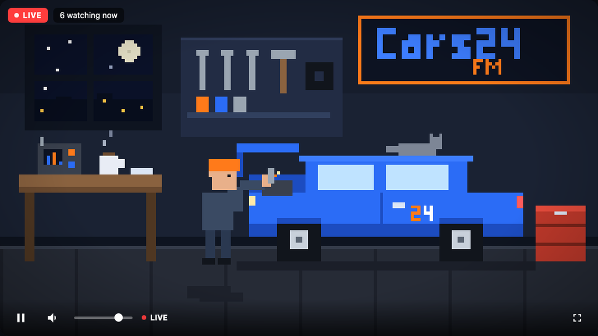

# Cars24 FM 🎵 music for thinking and driving

A Cars24 take on Anthropic's [Claude FM](https://www.youtube.com/live/tRsQsTMvPNg)
("music for thinking and building") — a 24/7 lo-fi livestream experience, rebuilt
as a single self-contained web page.



## What's inside

- **Hybrid endless audio**: 109 quality-screened Creative Commons tracks
  stream from the Internet Archive, shuffled and continuous, *woven with* the
  built-in AI lo-fi engine — every few songs the station hands off to a live
  generated interlude, so the stream never repeats and never stops. If a track
  URL ever fails, it falls straight through to generated music.
  - Real catalogue (`music/playlist.json`): Chris Zabriskie, Kevin MacLeod,
    Lee Rosevere, Broke For Free, Jahzzar, Kai Engel and others — all CC BY
    (commercial-safe with attribution, credited on the page).
  - Optional **ElevenLabs Music** batch generation: create original local
    instrumental tracks at build time with `scripts/generate-eleven-music.mjs`,
    then mix them into the same playlist without exposing any API key in the
    deployed site.
  - Optional **Cars24 celebration block** at **10:00 AM IST**: generate a daily
    spoken celebration segment and celebratory bed from local employee
    birthdays and anniversaries with `scripts/generate-birthday-block.mjs`,
    then let the player air it once per day on both the stream page and the
    website.
  - Optional **Cars24 Global Pulse bulletin** at **11:00 AM IST**: generate a
    short DJ-style business update directly from the monthly Slack post with
    `scripts/generate-business-update-block.mjs`, then let the station carry it
    once per day for the next few days.
  - Generative engine: Web Audio, no files. Swung lo-fi at ~72 BPM, diatonic 7th
    pads, sine bass, pentatonic melody through tape echo, drums, vinyl crackle.
- **Cars24 values v3 idents**: between tracks a classy typographic bumper drifts
  in — the brand line *"Better drives, better lives"* and the five values
  (Customer love, Builder mindset, Seek truth, Whatever we tolerate becomes our
  culture, Better humans), straight from values v3.
- **Pixel-art garage scene** on a 192×108 canvas: a mechanic working on a
  Cars24-blue car (head bobs to the beat), a sleeping cat, shooting stars, a
  flickering **Cars24 FM** neon sign, coffee steam, beat-synced EQ bars, sparks.
- **Livestream-style UI**: LIVE badge, drifting viewer count, like/subscribe
  chips, play overlay, volume, fullscreen, and keyboard shortcuts
  (`space` play/pause, `m` mute, `f` fullscreen).

## Run it

No build step, no dependencies:

```bash
open cars24-fm/index.html        # or just double-click it
# or serve it:
python3 -m http.server -d cars24-fm 8080
```

For OBS, use the dedicated clean 16:9 view. It hides the website information
panel and keeps a compact now-playing label inside the visual:

```text
https://vikramchopra.in/cars24-fm/?autoplay=1&stream=1
```

## Master the audio catalogue

Create a non-destructive, stream-ready copy of every local track at 48 kHz,
stereo, 256 kbps AAC, normalized to approximately -14 LUFS and -1 dB true peak:

```bash
./scripts/master-audio.sh
```

The output and report are written to `build/mastered-audio/`. This improves
consistency but cannot restore detail lost in a low-bitrate source; replace
128 kbps originals with WAV, FLAC, or high-quality AAC when available, then
run the script again.

The production catalogue has also been upgraded directly from verified
Internet Archive FLAC originals where available. To repeat the source upgrade
and quality gate:

```bash
node scripts/upgrade-archive-sources.mjs
node scripts/prune-low-quality-tracks.mjs
```

The quality gate removes playlist entries below 128 kbps. It leaves the source
files intact when no safe replacement exists, so licensing and attribution
history remain auditable in Git.

DJ speech is also protected in the browser with gentler music ducking, speech
compression, and a fast final limiter. OBS should retain its Compressor and
Limiter filters as the final broadcast safety stage.

## Generate ElevenLabs tracks

If `ELEVENLABS_API_KEY` is set locally on your machine, you can mint original
instrumental tracks into `music/` and optionally append them to the live
playlist:

```bash
cd cars24-fm
node scripts/generate-eleven-music.mjs --count 4 --duration-ms 60000 --add-to-playlist
```

This is a **build-time only** path. The static site never calls ElevenLabs in
the browser, so the API key stays local.
Generated files use the `Cars24 FM Originals - ...` prefix so they behave like
station-owned catalogue, not filler.

## Generate the celebration block

Put today’s employee celebrations in `data/celebrations.json`, then generate the
daily block:

```bash
cd cars24-fm
node scripts/generate-birthday-block.mjs --date 2026-06-18
```

Example input:

```json
[
  { "date": "2026-06-18", "type": "birthday", "name": "Aditi" },
  { "date": "2026-06-18", "type": "anniversary", "name": "Rohan", "years": 3 }
]
```

That writes:

- `music/birthday/today.json`
- `music/birthday/<date>-intro.mp3`
- `music/birthday/<date>-bed.mp3`

When the station is live, the block airs once at `10:00 AM IST`. If the site
is opened later that day, it replays once shortly after playback starts.

If there are no confirmed celebrations yet, leave `data/celebrations.json` as `[]`.
That is valid and produces a no-op manifest.

The intended source for that JSON is Darwinbox via the personal
`birthday-wishes` agent. Once Darwinbox dumps are refreshed, sync the FM handoff
file with:

```bash
node scripts/sync-celebrations-from-darwinbox.mjs --date 2026-06-19
```

## Generate the monthly business update block

When the monthly `Global Pulse` post lands in Slack, point the generator at the
permalink:

```bash
cd cars24-fm
node scripts/generate-business-update-block.mjs \
  --slack-link "https://cars24.slack.com/archives/C053XTBJC/p1780752190402179" \
  --days 3 \
  --trigger-time 11:00
```

That writes:

- `music/business-update/today.json`
- `music/business-update/<date>-intro.mp3`
- `music/business-update/<date>-bed.mp3`

Default behavior:

- airs once per day at `11:00 AM IST`
- remains active for `3` days starting from the day you generate it
- uses the Slack message plus attached PDF AI summary when available

If you want to backdate or pin the active window explicitly:

```bash
node scripts/generate-business-update-block.mjs \
  --slack-link "https://cars24.slack.com/archives/C053XTBJC/p1780752190402179" \
  --start-date 2026-06-18 \
  --days 3
```

To clear it after the window or disable it manually:

```bash
node scripts/generate-business-update-block.mjs --clear
```

## Publish as a personal channel

`publish.sh` packages the page into its own repo on your GitHub account and
(if the `gh` CLI is installed) turns on GitHub Pages for you:

```bash
cd cars24-fm
./publish.sh                     # uses vikramcars24 / cars24-fm
```

Your channel then goes live at:

```
https://vikramcars24.github.io/cars24-fm/
```

Without the `gh` CLI the script still pushes the repo, then enable Pages
manually: **Settings → Pages → Source: Deploy from branch → main / root**.

## Keep the office Mac broadcasting

After cloning or pulling this repository on the office Mac, run:

```bash
./scripts/install-office-stream.sh
```

This installs OBS when needed and creates a login service that keeps the Mac
awake and relaunches OBS with streaming enabled. Enter the YouTube stream key
once in OBS; credentials and keys always remain machine-local and outside Git.

> Unofficial concept. Not affiliated with YouTube or Anthropic.
